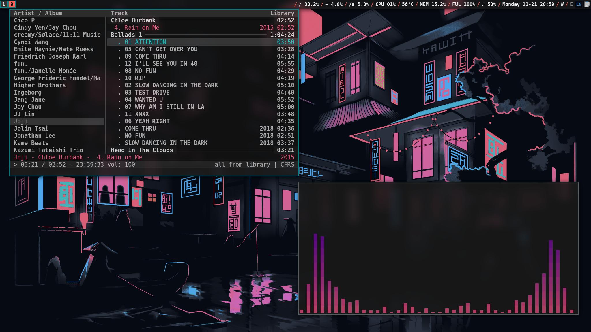
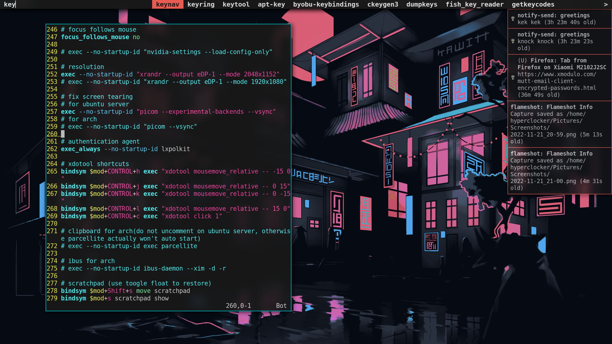
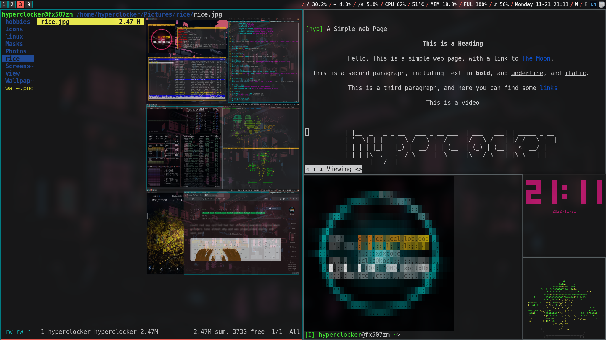
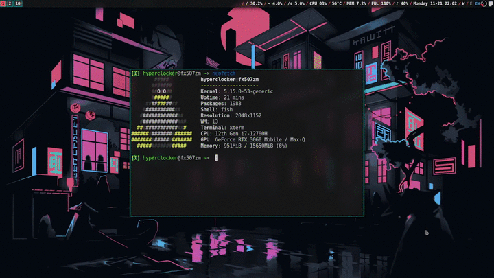

I configured this setup for Ubuntu Server 22.04.1 and Arch Linux.
Some lines need be commented/uncommented in `./i3/config` between two distros as they are makred there, in order to let things work properly.

You also need to change the `%HOME` paths in `./i3/config` and `./i3status/config/`.

`picom.conf` defaults to disable all visual effects.

---
## Screenshots
### cmus and cava  

### dmenu and dunst  
  

### tiling  

### picom

---
## Software that I use
- WM: i3wm
- Compositor: picom
- GTK2/3 theme: Adwaita black
- QT5 theme: Adwaita black
- Icon theme: [Fluent dark](https://github.com/vinceliuice/Fluent-icon-theme)  
- Terminal emulator: xterm && kitty
- Display manager: `startx` 

My pacman and apt packages list is [here](./packages.md).   

[survive TUI](./survive-tui.md)
